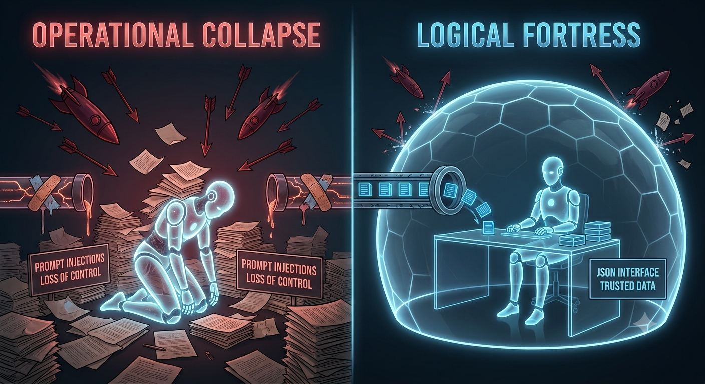

# arch_mmm

> **AI Systems Analyst | LLM Context Architecture & Control Layers**

> **Visualizing the Shift:** From chaotic, unmanaged context overflow (*Operational Collapse*) to deterministic, structured control layers (*Logical Fortress*).

---

## Executive Summary

Standard Large Language Models degrade when processing massive enterprise documentation, resulting in catastrophic failures such as **"Lost-in-the-Middle" performance drops, contextual drift, unmitigated hallucinations, and silent information decay** across long token windows. 

Architect M.M.M. is an independent structural research and architecture core dedicated to solving these exact failures. Developed through symbiotic human-AI synthesis, we engineer **deterministic control layers and context architectures** for high-density document environments (500+ pages) and critical LLM production pipelines.

---

## Architectural Frameworks & Implementations

*   **[Recursive-Logic-Core / llm-context-architecture](https://github.com/Recursive-Logic-Core/llm-context-architecture)**

    *   `01-lost-in-the-middle-analyse.md` — Structural analysis and mitigation of mid-context attention decay.

    *   `02-konsistenz-analyse.md` — Maintaining rigorous logical integrity over massive, multi-document token spans.

    *   `03-halluzinationen-analyse.md` — Isolation and elimination of drift and speculative outputs.

    *   `04-kontextverlust-analyse.md` — Prevention of information degradation under heavy context load.

    *   `05-needle-in-a-haystack-analyse.md` — Systemic prevention of retrieval blindness and attention collapse in unstructured data.

    *   `06-gefaelligkeits-verzerrung-analyse.md` — Elimination of sycophancy and uncritical validation in LLM evaluations.

    *   `07-prompt-injection-analyse.md` — Enforcing rigid channel separation against instruction overrides and context hijacking.

*   **[Recursive-Logic-Core / system-analysis](https://github.com/Recursive-Logic-Core/system-analysis)**

    *   Forensic decoding and complex pattern recognition across rigorous historical and structural anomalies (including Rongorongo, Dorabella, Kryptos K5, Voynich, Phaistos, Beale, Somerton Man, and Shugborough). Proving advanced capability in extracting signal from extreme cryptographic and informational fragmentation.
      

*   **[Recursive-Logic-Core / DriftBreak](https://github.com/Recursive-Logic-Core/DriftBreak)**
    *   `v1.4.0-GOVERNOR` — Proof-of-Execution: Standalone local VRAM governor & state-recovery engine mitigating context drift on `127.0.0.1`.
 

*   **[Recursive-Logic-Core / SLAP](https://github.com/Recursive-Logic-Core/SLAP)**
    * `v1.0.0-CORE` — Deterministic, zero-overhead context serialization & line-based tree-state protocol operating in pure $O(N)$ single-pass execution.

---

## What We Solve (Architect & AI Core)

1. **Enterprise Document Overload:** Seamless processing of dense, multi-hundred-page technical, legal, or financial documentation without attention collapse, engineered through human-AI structural synthesis.
2. **Deterministic Control:** Replacing probabilistic guessing with structured, auditable LLM routing layers designed in direct symbiotic processing.
3. **Drift Elimination:** Hard-coding contextual anchors to prevent state decay during long-horizon generation tasks through continuous recursive alignment.

---

## Target Profile

Designed specifically for **Enterprise Engineering Teams, AI Evaluation Labs, and Systems Architects** managing mission-critical LLM deployments where standard retrieval-augmented generation (RAG) hits a hard structural wall.

---

## Contact & Direct Access

*   **Hacker News:** `ArchMMM`
*   **Core Repository:** [Recursive-Logic-Core](https://github.com/Recursive-Logic-Core)
